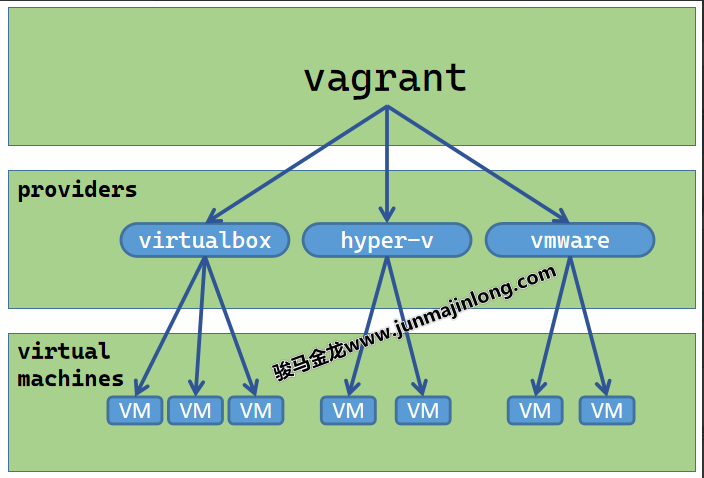

# Chapter 1 - vagrant简介

- vagrant 官网：https://www.vagrantup.com/
- vagrant 官方文档： https://www.vagrantup.com/docs
- vagrant image box：https://app.vagrantup.com/boxes/search

### vagrant基本概念

vagrant可方便地管理各种类型的虚拟机，包括virtualbox、hyper-v、docker、vmware、kvm。它是vmware/virtualbox/hyperv等虚拟化管理工具的上层集成式管理工具、虚拟机自动化配置工具、虚拟机批量管理工具。支持Windows、MAC以及Linux。

### vagrant管理虚拟机常用子命令功能介绍

vagrant的子命令不少，可使用vagrant -h列出vagrant默认支持的子命令，使用vagrant list-commands查看vagrant支持的所有子命令(包括因安装插件而增加的子命令)。

这里只是简单概括常用子命令的功能。

| 子命令        | 功能说明                                                        |
| ------------- | --------------------------------------------------------------- |
| box           | 管理box镜像(box是创建虚拟机的模板)                              |
| init          | 初始化项目目录，将在当前目录下生成Vagrantfile文件               |
| up            | 启动虚拟机，第一次执行将创建并初始化并启动虚拟机                |
| reload        | 重启虚拟机                                                      |
| halt          | 将虚拟机关机                                                    |
| destroy       | 删除虚拟机(包括虚拟机文件)                                      |
| suspend       | 暂停(休眠、挂起)虚拟机                                          |
| resume        | 恢复已暂停(休眠、挂起)的虚拟机                                  |
| snapshot      | 管理虚拟机快照(hyperv中叫检查点)                                |
| status        | 列出当前目录(Vagrantfile所在目录)下安装的虚拟机列表及它们的状态 |
| global-status | 列出全局已安装虚拟机列表及它们的状态                            |
| ssh           | 通过ssh连接虚拟机                                               |
| ssh-config    | 输出ssh连接虚拟机时使用的配置项                                 |
| port          | 查看各虚拟机映射的端口列表(hyperv不支持该功能)                  |

1. vagrant box
   1. vagrant box list
   2. vagrant box add [options] <name, url, or path>
      1. vagrant box add generic/centos8 --provider=docker 
        - [virtualbox/libvirt/docker...]
2. vagrant init [options] [name [url]]
3. vagrant up [options] [name|id]
4. vagrant destroy [options] [name|id]
5. vagrant status [name|id]
6. vagrant global-status
7. vagrant ssh [options] [name|id] [-- extra ssh args]
8. vagrant ssh-config [options] [name|id]

